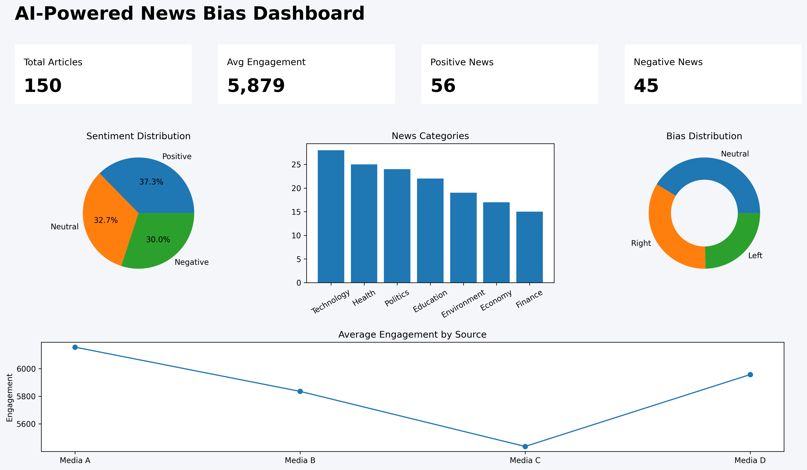

# AI-Powered News Bias Dashboard

## Project Overview
The AI-Powered News Bias Dashboard is a data analytics project focused on analyzing media sentiment, audience engagement, and reporting bias across multiple news sources and categories using Power BI.

This project demonstrates practical skills in:
- Data Analysis
- Data Visualization
- Dashboard Reporting
- Business Intelligence
- Data Cleaning & Transformation

---

## Dashboard Preview

---

## Key Features

- Sentiment analysis visualization
- Bias distribution tracking
- Category-wise news analysis
- Engagement trend analysis
- KPI summary cards
- Interactive dashboard filtering

---

## Tools & Technologies Used

- Power BI
- Excel / CSV
- Data Visualization
- Business Intelligence Reporting

---

## Dataset Information

The dataset includes:
- Article ID
- News Title
- Source
- Category
- Sentiment
- Bias Type
- Engagement Metrics

---

## Business Insights

- Negative sentiment articles generated higher engagement.
- Political and economic news categories showed higher reporting frequency.
- Different news sources displayed varying bias patterns.
- Audience engagement varied across sentiment categories.

---

## Repository Files

| File Name | Description |
|---|---|
| news_bias_dataset.csv | Dataset used for dashboard analysis |
| dashboard.png | Dashboard preview image |
| README.md | Project documentation |

---

## Project Objective

The objective of this project is to transform structured news data into meaningful insights through interactive dashboard reporting and analytical visualization techniques.

---

## Author

**Durga Darini S D**  
Aspiring Data Analyst | AI & Analytics Enthusiast
